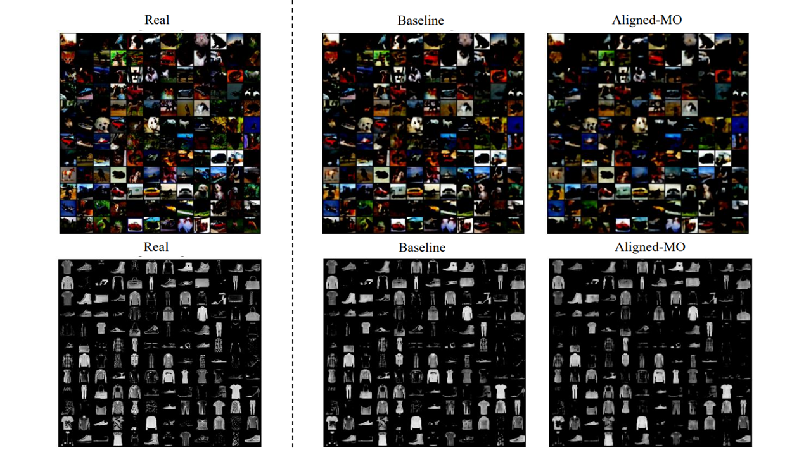

# MO-VAE
\
A multi-objective representation learning in variational autoencoder to stabilize the gradients calculated by breaking down the evidence lower bound (ELBO) loss function into two objectives.
Our proposed method, named aligned multi-objective VAE (Aligned-MO-VAE), inspired by the multi-task learning, integrates two objectives known as reconstrion error and KL divergence simulatenously to optimize parameters with a gradient system that has zero conflict with others.
## Installation
* Close the repository
```
git clone https://github.com/rkhosroshahli/MO-VAE
cd MO-VAE
```
* Let's create virtual environment (venv) in the project and install necessary packages using ```pip```.
```
python3 -m venv venv
source venv/bin/activate
pip install -r requirements.txt
```

<!-- USAGE EXAMPLES -->
## Usage
* Train VAE on CIFAR10 with aligned multi-objective learning algorithm with min scaler
```
python .\main.py --epochs 100 --optimizer multi --lr 0.001 --batch_size 32 --scaler min --seed 52 --dataset CIFAR10
```
* Train VAE on CIFAR10 with aligned multi-objective learning algorithm with RMSE scaler
```
python .\main.py --epochs 100 --optimizer multi --lr 0.001 --batch_size 32 --scaler rmse --seed 52 --dataset CIFAR10
```
* Train VAE on CIFAR10 with uniform weighted-sum loss function
```
python .\main.py --epochs 100 --optimizer single --lr 0.001 --batch_size 32 --scaler linear --seed 52 --dataset CIFAR10
```
<!-- CONTACT -->
## Contact
Rasa Khosrowshahli - rkhosrowshahli@brocku.ca